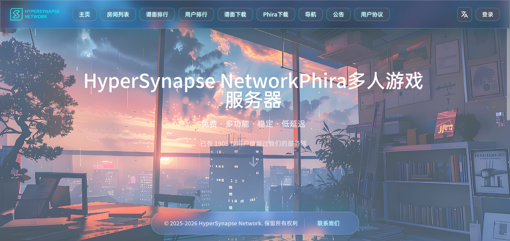

# HSNPhira Frontend

HyperSynapse Network Phira多人游戏服务器前端应用

## 项目简介

> 本项目由多个顶尖AI研究所提供技术支持<br>
> 本项目使用了多种AI工具进行开发

这是一个基于 Vue 3 + TypeScript + Tailwind CSS 构建的现代化Web应用，为HSNPhira多人游戏服务器提供完整的前端界面。
HSNPhira Frontend由HSNPhira Backend与phira-mp-logprocessor提供后端支持

## 技术栈

- **框架**: Vue 3 (Composition API)
- **语言**: TypeScript
- **构建工具**: Vite
- **样式**: Tailwind CSS
- **状态管理**: Pinia
- **路由**: Vue Router
- **HTTP客户端**: Axios
- **静态站点生成 (SSG)**: vite-ssg

## 项目结构

```
HSNPhira-frontend/
├── public/                     # 静态资源
│   ├── config/                # 配置文件
│   │   ├── app.config.json    # 应用配置（API路由、外部服务地址等）
│   │   ├── preferences.config.json  # 用户偏好配置
│   │   └── version.json       # 版本信息（用于自动更新检查）
│   └── index.html            # 主HTML文件
├── src/                       # 源代码
│   ├── api/                  # API接口层
│   │   ├── index.ts          # API客户端配置
│   │   ├── server.ts         # 服务器API封装
│   │   ├── charts.ts         # 谱面相关API
│   │   └── auth.ts           # 认证相关API
│   ├── components/           # 可复用组件
│   │   ├── common/          # 通用组件（Button、Table等）
│   │   ├── windows/         # 窗口组件（模态框、弹窗）
│   │   │   ├── Window.vue                # 基础窗口组件
│   │   │   ├── WindowChart.vue           # 谱面详情窗口
│   │   │   ├── WindowChartDownload.vue   # 谱面下载窗口
│   │   │   ├── WindowRoomHistory.vue     # 游玩历史窗口
│   │   │   └── WindowAuth.vue            # 认证窗口
│   │   └── background/      # 背景效果组件
│   ├── i18n/                 # 国际化配置
│   │   └── index.ts         # 多语言翻译文件（支持zh、zh-TW、en、ja）
│   ├── router/               # 路由配置
│   ├── stores/               # 状态管理（Pinia）
│   ├── utils/                # 工具函数
│   ├── types/                # TypeScript类型定义
│   ├── styles/               # 全局样式
│   │   └── main.css         # Tailwind CSS和自定义样式
│   ├── views/                # 页面视图组件
│   │   ├── Home.vue         # 主页
│   │   ├── RoomList.vue     # 房间列表
│   │   ├── ChartRanking.vue # 谱面排行榜
│   │   ├── UserRanking.vue  # 用户排行榜
│   │   ├── Announcement.vue # 公告页面
│   │   ├── Agreement.vue    # 用户协议页面
│   │   └── Account.vue      # 账户管理页面
│   ├── App.vue               # 根组件
│   ├── main.ts               # 应用入口
│   └── vite-env.d.ts         # Vite环境类型定义
├── package.json              # 项目依赖和脚本
├── tsconfig.json             # TypeScript配置
├── tsconfig.node.json        # Node.js环境TypeScript配置
├── vite.config.ts            # Vite构建配置（包含API代理）
├── tailwind.config.js        # Tailwind CSS配置
├── postcss.config.js         # PostCSS配置
└── .env.development          # 开发环境变量（API目标地址）
```

**说明**：
- 项目采用模块化设计，关注点分离清晰
- API层统一管理所有网络请求，便于维护和测试
- 组件按功能分类，windows组件用于模态交互
- 国际化配置集中管理，支持多语言切换
- 状态管理使用Pinia，替代Vuex
- 样式基于Tailwind CSS，支持响应式设计

## 快速开始

### 环境要求

- **Node.js** >= 16.0.0（推荐使用18.x或20.x LTS版本）
- **包管理器**: pnpm >= 8.0.0

### 安装依赖

```bash
# 如果未安装pnpm，请先安装（推荐方式）
npm install -g pnpm

# 安装项目依赖
pnpm install

# 或使用npm（不推荐，可能导致依赖冲突）
# npm install
```

### 配置后端API

**重要**: 在启动项目前，需要配置后端API地址。项目支持两种配置方式：

#### 1. 开发环境变量配置（推荐用于本地开发）
编辑 `.env.development` 文件：

```bash
# 后端API服务器地址（默认本地开发地址）
VITE_API_TARGET=http://localhost:8080

# 启用Vite代理（推荐开发时启用）
VITE_USE_PROXY=true
```

**配置说明**：
- `VITE_API_TARGET`: 后端服务器地址，开发时通常为 `http://localhost:8080`
- `VITE_USE_PROXY`: 是否启用Vite开发代理，启用后特定API路径将通过Vite转发到后端

#### 2. 应用配置文件（推荐用于生产环境）
编辑 `public/config/app.config.json`：

```json
{
  "apiMode": "remote",                    // "local" 或 "remote"
  "remoteBaseURL": "https://phira.htadiy.com",
  "localBaseURL": "http://localhost:8080"
}
```

**两种配置的交互**：
- **本地开发推荐配置**：`apiMode: "local"` + `VITE_USE_PROXY=true` + `VITE_API_TARGET=http://localhost:8080`
- **连接远程服务器**：`apiMode: "remote"` + `VITE_USE_PROXY=false`
- **生产环境**：根据实际部署位置设置 `apiMode`（前端构建后，通过修改配置文件切换目标服务器）

**注意**：当 `VITE_USE_PROXY=true` 时，开发代理会覆盖部分 `apiMode` 配置。详细说明请查看[API集成](#api集成)章节。

### 开发模式

```bash
# 启动开发服务器
pnpm dev
# 或 npm run dev

# 应用将在 http://localhost:3000 启动
```

**开发注意事项**：
1. **确保后端运行**：启动前端前，确保后端服务器已在 `http://localhost:8080` 运行（或您配置的地址）
2. **代理配置**：如果 `VITE_USE_PROXY=true`，API请求将自动代理到后端
3. **热重载**：代码修改会自动刷新页面，提高开发效率
4. **控制台输出**：开发服务器会显示构建错误和TypeScript检查结果

### 构建生产版本

```bash
# 执行TypeScript类型检查并构建（标准 SPA 模式）
pnpm build
# 或 npm run build

# 构建产物将输出到 dist/ 目录
```

**构建说明**：
- 构建过程会执行 `vue-tsc` 进行类型检查，确保TypeScript代码正确性
- 生产构建会优化代码、压缩资源、生成sourcemap
- 构建产物为纯静态文件，可部署到任何Web服务器

### 构建 SSG（静态站点生成）版本

```bash
# 预渲染所有静态路由为 HTML 文件（SSG 模式）
pnpm build:ssg
# 或 npm run build:ssg
```

**SSG 说明**：

SSG（Static Site Generation）会在构建时将每个路由预渲染为对应的 `index.html` 文件，输出到 `dist/` 目录。相比普通 SPA 构建，SSG 的优势包括：

- **更好的 SEO**：搜索引擎爬虫可以直接抓取完整的 HTML 内容，无需等待 JS 执行
- **更快的首屏加载**：用户首次访问即可获得完整的 HTML，无需等待 Vue 渲染
- **社交分享友好**：各平台的 Open Graph 爬虫可正确解析页面 meta 信息

**预渲染的路由**（不含需要登录的动态路由）：

| 路由 | 输出文件 |
|------|---------|
| `/` | `dist/index.html` |
| `/rooms` | `dist/rooms/index.html` |
| `/chart-ranking` | `dist/chart-ranking/index.html` |
| `/user-ranking` | `dist/user-ranking/index.html` |
| `/agreement` | `dist/agreement/index.html` |
| `/announcement` | `dist/announcement/index.html` |
| `/chart-download` | `dist/chart-download/index.html` |
| `/phira-download` | `dist/phira-download/index.html` |
| `/navigation` | `dist/navigation/index.html` |

> **注意**：`/account` 路由因需要登录鉴权，不参与 SSG 预渲染，仍以 SPA 方式在客户端渲染。

**部署 SSG 产物**：SSG 构建产物与普通构建完全兼容，可以用相同的 Nginx/Apache 配置部署。需保留 `try_files $uri $uri/ /index.html;` 以确保 SPA 回退路由正常工作。

### 预览生产构建

```bash
# 本地预览生产构建结果
pnpm preview
# 或 npm run preview

# 预览服务将在 http://localhost:4173 启动
```

**预览功能**：
- 使用Vite的预览服务器，模拟生产环境
- 检查构建产物是否正确运行
- 验证API代理在生产环境下的行为

## 配置说明

### 应用配置 (public/config/app.config.json)

```json
{
  "apiMode": "remote",                    // API模式: local（本地）或 remote（远程）
  "remoteBaseURL": "https://phira.htadiy.com",  // 远程API服务器地址
  "localBaseURL": "http://localhost:8080",      // 本地开发服务器地址
  "routes": {                              // API路由配置
    "auth": { "login": "/api/auth/login", ... },
    "rooms": { "list": "/api/rooms/info", ... },
    "charts": {
      "rank": "/chart/:id/rank",
      "chartRank": "/topchart/chart_rank/:chart_id",
      "hotRank": "/topchart/hot_rank/:timeRange"  // 注意：完整路径
    },
    "playtime": { "leaderboard": "/rankapi/playtime_leaderboard" }
  },
  "externalAPI": {
    "phiraBaseURL": "https://phira.5wyxi.com"  // 外部Phira API地址
  },
  "background": {
    "defaultImageURL": "https://webstatic.cn-nb1.rains3.com/5712×3360.jpeg"
  }
}
```

### 用户偏好配置 (public/config/preferences.config.json)

支持以下自定义选项:
- 主题颜色
- 毛玻璃背景透明度
- 背景粒子效果
- 背景图片
- 显示语言

## API集成

项目已预配置以下API端点，并已配置Vite开发代理：

### API端点配置
- 认证: `/api/auth/*`
- 房间: `/api/rooms/*`
- 排行榜: `/rankapi/playtime_leaderboard`
- 谱面信息: `/chart/*`
- 谱面排名: `/topchart/chart_rank/*`
- 谱面热门排行: `/topchart/hot_rank/*`（注意：路径为 `/topchart/hot_rank/`）
- 用户排行: `/user_rank/*`

### API模式配置（apiMode）
应用支持两种API模式，通过 `public/config/app.config.json` 中的 `apiMode` 配置：

```json
{
  "apiMode": "remote",                    // "local" 或 "remote"
  "remoteBaseURL": "https://phira.htadiy.com",
  "localBaseURL": "http://localhost:8080"
}
```

- **local 模式**：API请求发送到 `localBaseURL`（通常为本地开发服务器）
- **remote 模式**：API请求发送到 `remoteBaseURL`（生产服务器）

**注意**：在开发环境中，此配置的行为受 `VITE_USE_PROXY` 环境变量影响：
- 当 `VITE_USE_PROXY=true`（默认）时，开发服务器会代理特定路径到 `VITE_API_TARGET`，覆盖部分 `apiMode` 配置
- 当 `VITE_USE_PROXY=false` 时，`apiMode` 配置会完全生效

### 开发代理配置
在 `vite.config.ts` 中已配置以下代理规则（当 `VITE_USE_PROXY=true` 时生效）：

```javascript
proxy: {
  '/api': { target: 'http://localhost:8080' },
  '/rankapi': { target: 'http://localhost:8080' },
  '/chart': { target: 'http://localhost:8080' },
  '/topchart/hot_rank': { target: 'http://localhost:8080' },
  '/topchart/chart_rank': { target: 'http://localhost:8080' },
  '/chart_rank': { target: 'http://localhost:8080' },
  '/user_rank': { target: 'http://localhost:8080' }
}
```

**代理与apiMode的交互**：
- 开发环境中，对于使用Axios API实例的请求，代理会接管并忽略 `apiMode`
- 开发环境中，直接使用 `fetch()` 的请求会遵循 `apiMode` 配置
- 生产环境中，所有请求都遵循 `apiMode` 配置

### 外部API
部分功能（如谱面详情、用户头像）会直接调用外部Phira API（`https://phira.5wyxi.com`），这些请求不走代理，也不受 `apiMode` 影响。

### 推荐配置方案
1. **本地开发**：设置 `apiMode: "local"`，`VITE_USE_PROXY=true`，`VITE_API_TARGET=http://localhost:8080`
2. **连接远程服务器**：设置 `apiMode: "remote"`，`VITE_USE_PROXY=false`
3. **生产环境**：根据部署位置设置 `apiMode` 为 `local` 或 `remote`

## 部署

### Nginx配置示例

```nginx
server {
    listen 80;
    server_name your-domain.com;
    root /path/to/dist;
    index index.html;

    location / {
        try_files $uri $uri/ /index.html;
    }

    location /api {
        proxy_pass http://backend-server:8080;
        proxy_http_version 1.1;
        proxy_set_header Upgrade $http_upgrade;
        proxy_set_header Connection 'upgrade';
        proxy_set_header Host $host;
        proxy_cache_bypass $http_upgrade;
    }
}
```

## 开发指南

### 添加新页面

1. 在 `src/views/` 创建新的 Vue 组件
2. 在 `src/router/index.ts` 添加路由配置
3. 在 `Header.vue` 的 `navRoutes` 数组中添加导航链接

### 添加新API

1. 在 `src/api/` 创建对应的API模块
2. 在 `src/types/index.ts` 定义相关类型
3. 在组件中导入并使用

### 自定义样式

- 全局样式: `src/styles/main.css`
- Tailwind配置: `tailwind.config.js`
- 主题色通过CSS变量 `--primary-color` 控制

## 浏览器支持

- Chrome >= 90
- Firefox >= 88
- Safari >= 14
- Edge >= 90

## 效果
可以前往 [HSNPhira官网](https://phira.htadiy.com/) 查看部署效果


## 后续计划

- [ ] 完成帐户管理相关功能
- [ ] 添加暗黑模式支持

## 许可证

本项目采用 GNU Affero General Public License（AGPL）3.0 开源协议。

### 版权声明
版权所有 © HyperSynapse Network。保留所有权利。

### 开发者义务
根据 AGPL-3.0 协议，使用、修改或分发本项目的开发者必须：
- 保留原项目的版权和许可证声明。
- 在分发时提供完整的源代码。
- 任何基于本项目的衍生作品也必须使用 AGPL-3.0 协议开源。

详细条款请查看 [GNU AGPL v3.0](https://www.gnu.org/licenses/agpl-3.0.html) 许可证全文。

## 联系方式

- QQ群: 1049578201
- 邮箱: nb3502022@outlook.com
- GitHub: https://github.com/HyperSynapseNetwork/HSNPhira

## 致谢

感谢以下朋友为本项目做出的贡献，没有他们就没有本项目的现在（排名不分先后，如有遗漏非常抱歉）：

### 开发贡献
感谢以下开发者为项目开发、测试与资助做出的贡献：
*   **[TeamFlos](https://github.com/TeamFlos)**
    *   原项目 **Phira**：[Phira](https://github.com/TeamFlos/Phira)
    *   原项目 **Phira-MP**：[Phira-MP](https://github.com/TeamFlos/Phira-MP)
*   **[htadiy](https://github.com/htadiy)**
*   **[ExplodingKonjac](https://github.com/ExplodingKonjac)**
*   **[LY-Xiang](https://github.com/LY-Xiang)**
*   **[AFewSuns](https://github.com/AFewSuns)**

### 设计、资助与支持
*   感谢 **Ght/F=1** 参与设计了本项目图标。
*   感谢 **永远鲜红的砕月** 资助了本项目。
*   感谢 **Grizz** 资助了本项目。
*   感谢 **緒山_** 资助了本项目。
*   感谢 **AFewSuns** 资助了本项目。
*   感谢 **Explodingkonjac** 资助了本项目。
*   感谢 **Lusyu** 资助了本项目。
*   感谢 **雪人** 资助了本项目。
*   感谢 **Ayachi nene** 资助了本项目。
*   感谢 **荆棘谷** 资助了本项目。
*   感谢 **问号问号感叹号** 资助了本项目。
*   感谢 **李任渊** 资助了本项目。
*   感谢 **[Dmocken](https://github.com/Dmocken)** 为本项目宣传与监控服务器状态提供了支持。

### 社区贡献
感谢其他所有为 Phira 开源社区生态做出贡献的开发者！

### 特别感谢
感谢 **Claude** 与 **Deepseek** 对本项目的支持。
感谢 **雨云** 对本项目的支持
