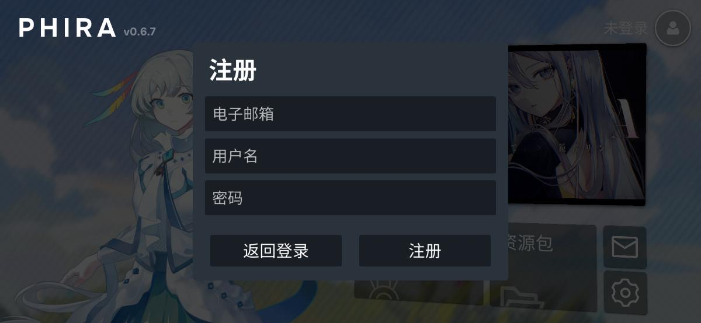
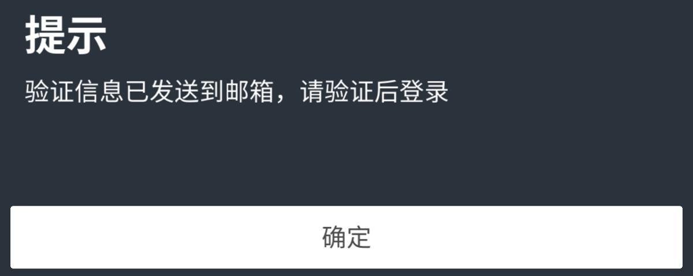
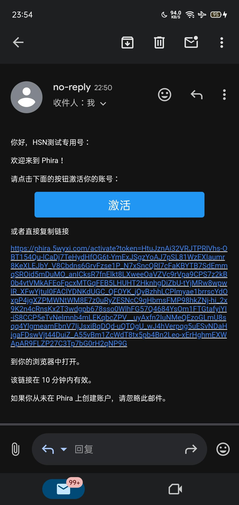
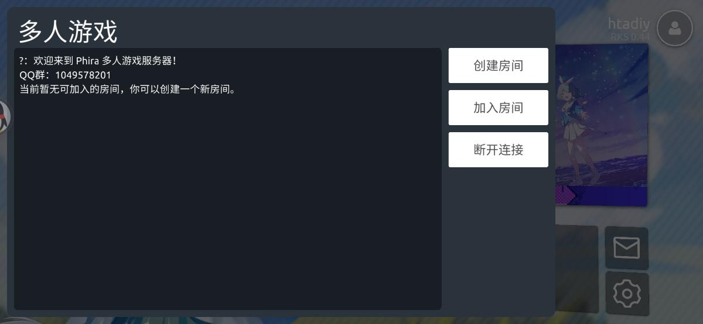
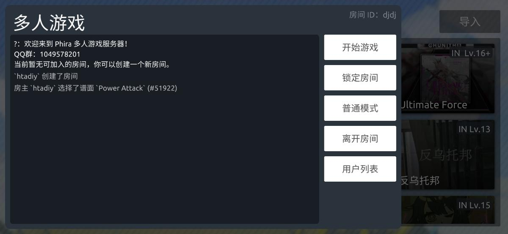

## 0.前言

在正文开始前你必须知道什么是Phira，其完整介绍可以前往 [https://pgrfm.miraheze.org/wiki/Phira](https://pgrfm.miraheze.org/wiki/Phira) 查看。

## 1.下载Phira

### 方式1：

要下载Phira，你可以访问[HSN的Phira下载页](https://phira.htadiy.com/phira-download)，选择Android、Linux以及Windows平台的下载。

### 方式2：

要下载Phira，你可以访问[Phira的官方Release页面](https://github.com/TeamFlos/phira/releases) ，找到带有Latest绿色标识的板块，展开Assets选择下载。

### 方式3：

要下载Phira，你也可以前往Dmocken的[Phira下载站](https://phira.dmocken.top/)，选择对应的平台（Android、Linux、iOS以及Windows平台）进行下载。（iOS下载Phira需要AppStore外区账号，详情请见下载站的说明）

## 2.Phira的登录/注册

在打开Phira后，请先点击右上角的头像图标，接着会有两个输入框，点击注册按钮即可开始注册，会有三个输入框。

在第一个输入框输入你的电子邮箱，如果你不知道什么是电子邮箱请使用QQ邮箱，格式为：你的QQ号@qq.com在第二个输入框中输入你的用户名（如果后面提示重复你改就行了），最后在第三行填上你的密码。在所有东西都填入后，你就可以点击注册了。

点击注册后会有一个提示验证信息已发至你的电子邮箱（没验证你的账号是无法使用的）

接下来请你登录你的电子邮箱（如果是QQ邮箱直接在主页搜索QQ邮箱即可）找到与验证相关的最新邮件（如果没有请检查垃圾箱），点击里面的链接即可完成验证。（如下图所示）

之后再填入你刚刚注册时填的信息，就可以正常登录游玩了。

## 3.Phira的游玩

点击页面上的游玩，进入选择谱面界面，选择一个你喜欢的谱面，点击下载图标即可开始游玩，详细规则请看看Phigros。

## 4.Phira的多人游戏模式

在Phira的设置页面中，你会看到多人游戏功能，打开它即可使用多人游戏功能（会有一个悬浮球）。

在连接之前，你需要一个服务器地址，因为默认的服务器地址是不可用的（

这里有以下免费其实也没有付费的啦～服务器可选

-   HSN服务器（链接service.htadiy.cc:7865）C++ Server
    
-   Auto服务器(链接yee.autos:2000)TypeScript Server
    
-   等等还有一些你可以去[https://status.dmocken.top/](https://status.dmocken.top/)查看更多的服务器
    

推荐你们使用我们的HSNPhira服务器喵！已稳定运行半年多啦🎉因为我是HSN的，当然是力荐HSN了（

填上了服务器地址后，你就可以点击悬浮球，点击连接。（如下图所示，连接成功后页面）

之后就可以创建房间与你的朋友一起游玩了（当然要是一个服务器地址才行）。

如果提示你要选择谱面只需在已创建房间的状态下，进入谱面选择列表点击即可选择一个谱面（当然也只能选一个）。

如果想让你的好友加入房间，你需要记住你创建房间时输入的id，忘了也没关系，你依旧可以在悬浮窗页面的右上角也能看到你当前房间的id。

当然！如果您使用的是像HSNPhira这样支持房间列表查询的服务器，您还可以使用服务器提供的房间查询服务加入别人的房间，或者是被别人加入这话好怪啊（，比如当您使用HSNPhira服务器时您就可以通过访问 [HSNPhira房间查询页面](https://phira.htadiy.com/rooms) 或者是添加我们的QQ群1049578201使用HSNBot查询。

## 5.Phira热门谱面的问题

在谱面下载页面，你会发现官方的热门谱面查询功能无法使用的情况，所以我们专门把这个功能做出来啦，你可以访问[HSN热门谱面](https://phira.htadiy.com/chart-ranking)获取热门谱面信息。

## 6.一些来自HSN的小工具

在[HSNPhira的官方网站](https://phira.htadiy.com/)中，你可以看到我们有Phira谱面下载，社区页面导航等功能供您使用。

## 7.Phira社区

Phira有自己的[官方QQ频道](https://pd.qq.com/s/z5rk3efd?b=9)，当然如果你喜欢HSN服务器，也欢迎加入HSN的官方QQ群：1049578201

（如果你有加入HSN的开发意向，欢迎向HSN开发团队招募[https://v.wjx.cn/vm/rCUAXVd.aspx]提交问卷。）
